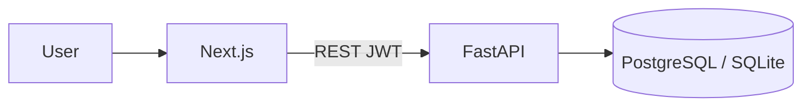

# DESIGN — Melómanos Marketplace

**Purpose:** Workspace **design index** — flows and entry points, with pointers to authoritative architecture.  
**Last synced:** 2026-06-17 (constraint pass)

> **Authoritative technical design:** [`backend/ARCHITECTURE.md`](../backend/ARCHITECTURE.md)  
> **Authoritative business flows:** [`backend/BUSINESS_RULES.md`](../backend/BUSINESS_RULES.md)  
> On conflict, those files override this index.

---

## System Context

See [`backend/ARCHITECTURE.md`](../backend/ARCHITECTURE.md) — **System Overview**, **High Level Flow**, **Data Ownership**.

---

## Backend (pointer)

| Topic | Read |
|-------|------|
| Layer structure, modules | [ARCHITECTURE § Backend Modules](../backend/ARCHITECTURE.md) |
| Routers registered | [`backend/app/main.py`](../backend/app/main.py) |
| Escrow happy / dispute paths | [ARCHITECTURE § Escrow Architecture](../backend/ARCHITECTURE.md) |
| Order / payment / dispute statuses | Same section |
| Atomic reservation | [ARCHITECTURE § Listings](../backend/ARCHITECTURE.md), [`listings.py`](../backend/app/routers/listings.py), [`orders.py`](../backend/app/routers/orders.py) |
| Models | [`backend/app/models/`](../backend/app/models/) |
| Services | [`backend/app/services/`](../backend/app/services/) |

---

## Frontend (pointer)

| Topic | Read |
|-------|------|
| Stack | [`frontend/package.json`](../frontend/package.json), [ARCHITECTURE § Frontend Modules](../backend/ARCHITECTURE.md) |
| API client | [`frontend/src/lib/api.ts`](../frontend/src/lib/api.ts) |
| Pages (App Router) | [`frontend/src/app/`](../frontend/src/app/) |

### Route map (entry points only)

| Route | File |
|-------|------|
| `/` | [`page.tsx`](../frontend/src/app/page.tsx) |
| `/login` | [`login/page.tsx`](../frontend/src/app/login/page.tsx) |
| `/sell` | [`sell/page.tsx`](../frontend/src/app/sell/page.tsx) |
| `/listings/[id]` | [`listings/[id]/page.tsx`](../frontend/src/app/listings/[id]/page.tsx) |
| `/favorites` | [`favorites/page.tsx`](../frontend/src/app/favorites/page.tsx) |
| `/messages` | [`messages/page.tsx`](../frontend/src/app/messages/page.tsx) |
| `/orders`, `/orders/[id]` | [`orders/`](../frontend/src/app/orders/) |
| `/profile` | [`profile/page.tsx`](../frontend/src/app/profile/page.tsx) |
| `/admin` | [`admin/page.tsx`](../frontend/src/app/admin/page.tsx) |

**Config note:** `API_BASE` is hardcoded in [`api.ts`](../frontend/src/lib/api.ts) — production URL: see [`MVP_ROADMAP` Production Deployment](../backend/MVP_ROADMAP.md).

---

## User Flows (index)

| Flow | Authoritative detail | Frontend entry |
|------|---------------------|----------------|
| Anonymous browse | [ARCHITECTURE](../backend/ARCHITECTURE.md) | `/`, `/listings/[id]` |
| Buyer purchase + escrow | [ARCHITECTURE § Escrow](../backend/ARCHITECTURE.md), [BUSINESS_RULES § Compra Segura](../backend/BUSINESS_RULES.md) | `ListingDetailActions` → `/orders/[id]` |
| Seller publish + fulfill | [BUSINESS_RULES § Marketplace](../backend/BUSINESS_RULES.md) | `/sell`, `/orders` |
| Messaging | [BUSINESS_RULES § Protected Messaging](../backend/BUSINESS_RULES.md) | `/messages`, listing detail |
| Disputes | [ARCHITECTURE § Escrow Architecture](../backend/ARCHITECTURE.md) | `/orders/[id]` dispute section |
| Admin ops | [`backend/PROJECT_STATUS.md`](../backend/PROJECT_STATUS.md) | `/admin` |

**Reservation path used by UI:** `POST /orders/from-listing/{id}` (not standalone `/reserve`). See [`orders.py`](../backend/app/routers/orders.py).

**Payment today:** `simulate-payment` only. **Target:** [`MVP_ROADMAP` WebPay item](../backend/MVP_ROADMAP.md).

---

## Deployment & Testing (pointer)

| Topic | Read |
|-------|------|
| Local run | [`workspace/README_LOCAL_RUN.md`](README_LOCAL_RUN.md) |
| Paths / env | [`workspace/README_PROJECT_LAYOUT.md`](README_PROJECT_LAYOUT.md) |
| Docker | [`backend/docker-compose.yml`](../backend/docker-compose.yml) |
| Quality gate | [`workspace/QUALITY_GATE.md`](QUALITY_GATE.md) |
| E2E | [`frontend/e2e/melomanos.spec.ts`](../frontend/e2e/melomanos.spec.ts) |

---

## Source Documents

| Priority | Document | Path |
|----------|----------|------|
| 1 | Architecture | [`backend/ARCHITECTURE.md`](../backend/ARCHITECTURE.md) |
| 2 | Business rules | [`backend/BUSINESS_RULES.md`](../backend/BUSINESS_RULES.md) |
| 3 | MVP roadmap | [`backend/MVP_ROADMAP.md`](../backend/MVP_ROADMAP.md) |
| 4 | API bootstrap | [`backend/app/main.py`](../backend/app/main.py) |
| 5 | Frontend API | [`frontend/src/lib/api.ts`](../frontend/src/lib/api.ts) |
| 6 | Architecture (docs) | [`backend/docs/architecture.md`](../backend/docs/architecture.md) |
| 7 | Project scan | [`workspace/AI_DEV_OS_PROJECT_SCAN.md`](AI_DEV_OS_PROJECT_SCAN.md) |

---

*Do not duplicate diagrams or status tables from ARCHITECTURE.md — link to the relevant section instead.*
