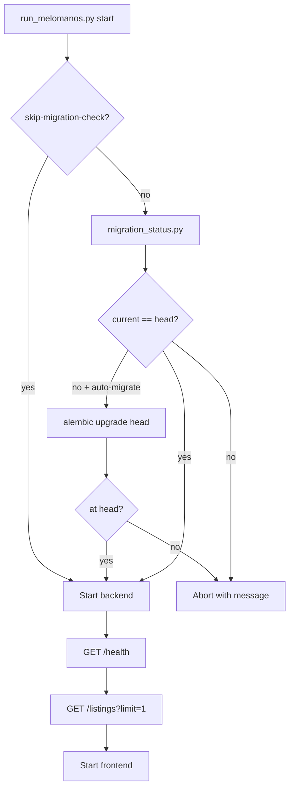

# Migration Mismatch Postmortem — `cover_image_url`

**Date:** 2026-06-19  
**Severity:** High (local dev stack broken)  
**Status:** Resolved + prevention added

---

## Summary

The API crashed at runtime with:

```text
psycopg2.errors.UndefinedColumn: column vinyl_listings.cover_image_url does not exist
```

Demo Data Phase 2 added `cover_image_url` to the SQLAlchemy model and Alembic revision `f0a1b2c3d4e5`, but the developer’s **local PostgreSQL** database remained at revision `e8f9a0b1c2d3`. The ORM generated SQL referencing a column that did not exist in Postgres.

---

## Root cause

| Factor | Detail |
|--------|--------|
| **Code change** | Phase 2 added `VinylListing.cover_image_url` + migration `f0a1b2c3d4e5_add_vinyl_listing_cover_image_url.py` |
| **Database state** | Local Postgres (`vinyl_test`) stuck at `e8f9a0b1c2d3` |
| **Startup path** | `py run.py` / uvicorn starts without verifying Alembic head |
| **First failure** | `GET /listings?limit=1` (and any listing query) — not `GET /health` |

`GET /health` does not touch the database, so the process appeared “up” while listing endpoints failed.

**Operator sequence observed:**

1. `py run_melomanos.py --check` → backend not ready (500 on listings)
2. `alembic upgrade head` run from **`workspace/`** → failed (`No 'script_location' key`)
3. Same command from **`backend/`** → succeeded (`e8f9a0b1c2d3` → `f0a1b2c3d4e5`)

---

## Why tests did not catch it

Pytest uses an **isolated SQLite** database, not local PostgreSQL:

```python
# tests/conftest.py (excerpt)
os.environ["DATABASE_URL"] = f"sqlite:///{_test_db_path.as_posix()}"
Base.metadata.drop_all(bind=engine)
Base.metadata.create_all(bind=engine)  # full ORM schema every test
```

| Environment | Schema source | Alembic |
|---------------|---------------|---------|
| **pytest** | `Base.metadata.create_all()` from current models | Not run |
| **Local dev** | PostgreSQL + manual / forgotten `alembic upgrade head` | Required |
| **CI (GitHub Actions)** | Empty Postgres + `alembic upgrade head` | Run in pipeline |

Therefore:

- All **261 pytest** tests could pass while Postgres lacked `cover_image_url`.
- CI would catch missing migrations on **fresh Postgres**, but not a stale **local** database.
- No gate ran before `run_melomanos.py` compared `alembic current` vs `alembic heads`.

---

## Fix applied

### 1. Database migration

```bash
cd backend
alembic current   # was: e8f9a0b1c2d3
alembic heads     # f0a1b2c3d4e5 (head)
alembic upgrade head
```

Applied revision: **`f0a1b2c3d4e5`** — adds nullable `vinyl_listings.cover_image_url`.

### 2. Prevention — migration status script

**New:** [`backend/scripts/migration_status.py`](../backend/scripts/migration_status.py)

- Compares `alembic current` vs `alembic heads`
- Lists pending revisions via `alembic history -r current:head`
- Exit `0` at head, `1` if behind, `2` on Alembic errors
- `--upgrade` runs `alembic upgrade head`

**Tests:** [`backend/tests/test_migration_status.py`](../backend/tests/test_migration_status.py) (parsing + error message)

### 3. Prevention — dev launcher gate

**Updated:** [`workspace/run_melomanos.py`](../workspace/run_melomanos.py)

| Flag | Behavior |
|------|----------|
| *(default)* | Abort startup if DB ≠ Alembic head |
| `--auto-migrate` | Run `alembic upgrade head`, then start |
| `--skip-migration-check` | Bypass (not recommended) |

Readiness checks now probe:

1. `GET /health` — liveness
2. `GET /listings?limit=1` — DB-backed ORM path

### 4. Documentation

- [`backend/README_DEPLOYMENT.md`](../backend/README_DEPLOYMENT.md) — local migration gate
- [`backend/TESTING_STRATEGY.md`](../backend/TESTING_STRATEGY.md) — pytest vs Postgres discrepancy
- [`workspace/QUALITY_GATE.md`](QUALITY_GATE.md) — migration check before stack

---

## Validation results

| Check | Result |
|-------|--------|
| `alembic current` | `f0a1b2c3d4e5 (head)` |
| `alembic heads` | `f0a1b2c3d4e5 (head)` |
| `cover_image_url` column in Postgres | **Present** |
| `py scripts/migration_status.py --check` | **Pass** |
| `GET /health` | **200** `{"status":"ok","service":"melomanos-api"}` |
| `GET /listings?limit=1` | **200** |
| `py run_melomanos.py --check` | Migration gate **pass**; backend probes **pass**; frontend not running (expected) |
| `py -m pytest tests/test_migration_status.py` | **4 passed** |

Homepage (`http://localhost:3000`) was not validated — frontend not running during this check. Start with `py run_melomanos.py --auto-migrate` for full stack verification.

---

## Prevention mechanism (ongoing)



**Recommended local workflow after pulling backend changes:**

```powershell
cd C:\melomanos\backend
py scripts/migration_status.py --check
# or
cd C:\melomanos\workspace
py run_melomanos.py --auto-migrate
```

---

## Known limitations

1. **`py run.py` alone** still does not run migration checks — use `run_melomanos.py` or run `migration_status.py` first.
2. **Pytest** will continue to skip Alembic; integration tests against dev Postgres remain optional future work.
3. **`--skip-migration-check`** can reintroduce the failure mode.
4. **Production** relies on explicit `docker compose exec api alembic upgrade head` in deploy runbook (unchanged).

---

## Action items (optional follow-ups)

- [ ] Add `migration_status.py --check` to `run_audit.py` before E2E stack auto-start
- [ ] Log Alembic revision at API startup (informational only)
- [ ] Document in `backend/README.md` local dev section (link to this postmortem)

---

*No business logic or API behavior was changed — migration consistency and startup safety only.*
