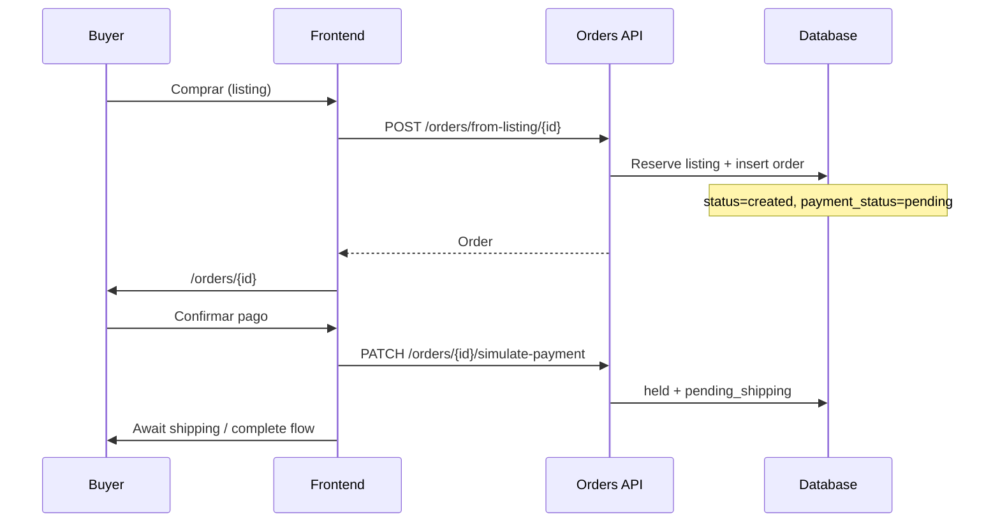
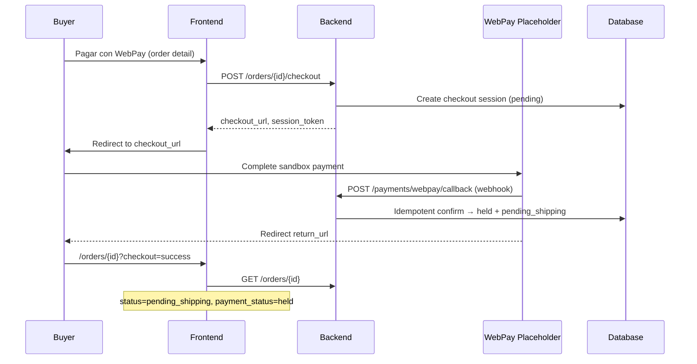
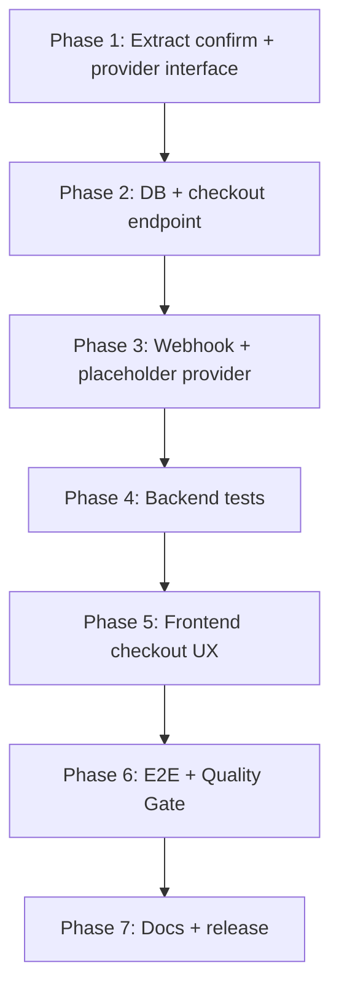

# WebPay Integration Design — Melómanos Marketplace

**Document type:** Implementation Preparation — Solution Architecture  
**Phase:** Implementation Preparation  
**Active task:** Payment Provider Integration (WebPay placeholder)  
**Status:** DESIGN ONLY — no code changes  
**Date:** 2026-06-17  
**Author:** AI Dev OS Solution Architect

> **Authority:** This design must conform to [`backend/BUSINESS_RULES.md`](../backend/BUSINESS_RULES.md), [`backend/ARCHITECTURE.md`](../backend/ARCHITECTURE.md), and [`backend/MVP_ROADMAP.md`](../backend/MVP_ROADMAP.md). On conflict, backend documents win until intentionally updated in the same release.

---

## 1. Executive Summary

Melómanos today confirms buyer payment via `PATCH /orders/{id}/simulate-payment`, which atomically sets `payment_status = held` and `order.status = pending_shipping` without an external gateway. The WebPay placeholder milestone introduces a **PaymentProvider abstraction** so the same escrow semantics are reached through a **checkout session + provider callback/webhook**, while preserving simulate mode for local dev, tests, and rollback.

**Design goal:** Replace the buyer-facing “confirm payment” action with a checkout flow that can redirect to WebPay sandbox (placeholder), without changing post-payment lifecycle (shipping → complete → release, disputes, refunds).

---

## 2. Current State Analysis

### 2.1 Backend architecture (relevant)

| Layer | Location | Role today |
|-------|----------|------------|
| Router | `backend/app/routers/orders.py` | Order CRUD lifecycle, `simulate-payment` |
| Service | `backend/app/services/escrow.py` | `compute_escrow_amounts()` — fee + totals |
| Model | `backend/app/models/order.py` | `status`, `payment_status`, escrow timestamps |
| Disputes | `backend/app/services/dispute.py` | Requires `payment_status` in `held`/`paid` to open dispute |
| Config | `backend/app/core/config.py` | No payment provider settings yet |

Routers are thin; business transitions live in `orders.py` and `dispute.py`. New payment logic should move into **`app/services/payment/`** (or `payment_provider.py`) to match existing patterns.

### 2.2 Frontend architecture (relevant)

| Area | Location | Role today |
|------|----------|------------|
| Order detail | `frontend/src/app/orders/[id]/page.tsx` | Payment UI, shipping, complete, review, dispute |
| API client | `frontend/src/lib/api.ts` | `simulatePayment()` → `PATCH .../simulate-payment` |
| Escrow display | `frontend/src/components/OrderEscrowCard.tsx` | Amount breakdown, fund status |
| Order helpers | `frontend/src/lib/orders.ts` | `orderNeedsPayment()` when `status` is `created` or `pending_payment` |
| Buy flow | `frontend/src/components/ListingDetailActions.tsx` | `createOrderFromListing` → `/orders/{id}` |

Payment CTA: `data-testid="order-confirm-payment"` on order detail (used by E2E).

### 2.3 Orders flow (today)



### 2.4 Escrow flow (today)

Per [`backend/ARCHITECTURE.md`](../backend/ARCHITECTURE.md) Escrow Architecture and [`backend/BUSINESS_RULES.md`](../backend/BUSINESS_RULES.md) Compra Segura:

| Step | Order `status` | `payment_status` | Side effect |
|------|----------------|------------------|-------------|
| Order created | `created` | `pending` | Listing `reserved` |
| Payment confirmed | `pending_shipping` | `held` | `funds_held_at`, amounts set |
| Seller ships | `shipped` | `held` | Tracking fields |
| Buyer completes | `completed` | `released` | Listing `sold` |
| Cancel (pre-ship, held) | `cancelled` | `refunded` | Listing released |
| Dispute resolve buyer | `refunded` | `refunded` | Via `dispute.py` |
| Dispute resolve seller | `completed` | `released` | Via `dispute.py` |

**Amounts:** `amount_paid_clp = listing_price_clp + platform_fee_clp` (default fee **990 CLP**); seller receives `listing_price_clp`.

### 2.5 `simulate-payment` implementation (today)

Source: `backend/app/routers/orders.py` — `simulate_order_payment`

**Preconditions:**
- Caller is **buyer**
- `payment_status == pending`

**Effects:**
- Recomputes amounts via `compute_escrow_amounts`
- `payment_status` → `held`
- `payment_confirmed_at`, `funds_held_at` → now
- `status` → `pending_shipping`

**Not used today:** `order.status = pending_payment` on create (order stays `created` until payment). Frontend `orderNeedsPayment()` accepts both `created` and `pending_payment`.

### 2.6 MVP roadmap requirements

From [`backend/MVP_ROADMAP.md`](../backend/MVP_ROADMAP.md) item #1 and Current Active Task:

| Requirement | Source |
|-------------|--------|
| `PaymentProvider` abstraction | Roadmap backend |
| `POST /orders/{id}/checkout` | Roadmap backend |
| Webhook endpoint + idempotency | Roadmap backend |
| Map provider events → `held` / `refunded` | Roadmap backend |
| Checkout button → redirect/simulate sandbox | Roadmap frontend |
| Backend tests: checkout session, webhook | Roadmap tests |
| E2E: sandbox payment → `pending_shipping` | Roadmap E2E |
| Dependencies: Escrow MVP ✅, Seller Payout Profile ✅ | Roadmap |

**Note:** Payout profile exists for future fund release to seller bank data; WebPay placeholder does **not** require changing release logic in this milestone.

---

## 3. Desired Payment Flow (Target)

### 3.1 Happy path — WebPay placeholder / sandbox



### 3.2 Design principles

1. **Single confirmation function** — `confirm_order_payment_held(order, ...)` shared by simulate, webhook, and sandbox stub (DRY escrow transition).
2. **Idempotent webhooks** — duplicate provider notifications must not double-apply state.
3. **Provider behind interface** — `PaymentProvider` with `simulate` and `webpay_placeholder` implementations.
4. **Escrow semantics unchanged** — post-`held` flow identical to today.
5. **Feature-flagged rollout** — `PAYMENT_PROVIDER_MODE` selects provider without breaking dev/E2E.
6. **Buyer-only checkout** — same authorization as `simulate-payment`.

### 3.3 Modes

| Mode | Env value | Buyer experience | Use case |
|------|-----------|------------------|----------|
| `simulate` | default for local/E2E | Existing “Confirmar pago” button | Dev, regression, rollback |
| `webpay_placeholder` | sandbox | Redirect to placeholder URL that auto-posts webhook | Integration test, demo |
| `webpay` | future | Real Transbank WebPay Plus | Production (out of placeholder scope) |

Placeholder milestone delivers **`simulate` + `webpay_placeholder`**; real Transbank SDK wiring is a follow-up within the same abstraction.

---

## 4. WebPay Placeholder Integration Model

### 4.1 `PaymentProvider` interface (proposed)

```python
# Conceptual — not implemented
class PaymentProvider(Protocol):
    def create_checkout_session(
        self,
        *,
        order: Order,
        return_url: str,
        cancel_url: str,
    ) -> CheckoutSessionResult: ...

    def parse_webhook(self, payload: dict, headers: dict) -> ProviderPaymentEvent: ...

    def verify_webhook(self, payload: dict, headers: dict) -> bool: ...
```

**Implementations:**
- `SimulatePaymentProvider` — wraps existing simulate logic (no external URL).
- `WebPayPlaceholderProvider` — returns internal sandbox page URL; webhook signed with shared secret.

### 4.2 Checkout session model (proposed)

Persist provider-agnostic session for audit and idempotency:

| Field | Purpose |
|-------|---------|
| `id` | PK |
| `order_id` | FK → orders |
| `provider` | `simulate` \| `webpay_placeholder` \| `webpay` |
| `provider_session_id` | External or generated token |
| `amount_clp` | `amount_paid_clp` at creation |
| `status` | `pending` \| `completed` \| `failed` \| `expired` |
| `checkout_url` | Redirect target (nullable for simulate) |
| `idempotency_key` | Unique per checkout attempt |
| `provider_payload` | JSON audit blob |
| `created_at`, `updated_at`, `completed_at` | Timestamps |

### 4.3 Webhook / callback (placeholder)

| Endpoint | Auth | Purpose |
|----------|------|---------|
| `POST /payments/webpay/callback` | HMAC or shared secret header | Provider → confirm payment |
| `GET /payments/webpay/return` | Public redirect | Optional; frontend can poll order instead |

**Idempotency:** Store `provider_event_id` (or hash of payload) in `payment_events` table; ignore duplicates with 200 OK.

**Mapping:**

| Provider event | Order transition |
|----------------|------------------|
| `payment.approved` | Same as `simulate-payment` → `held`, `pending_shipping` |
| `payment.failed` | Session `failed`; order stays `pending` / `pending_payment` |
| `payment.refunded` | Only via existing dispute/cancel paths in MVP (no new auto-refund from placeholder) |

---

## 5. Backend Endpoints Required

### 5.1 New endpoints

| Method | Path | Auth | Description |
|--------|------|------|-------------|
| `POST` | `/orders/{order_id}/checkout` | Buyer JWT | Create checkout session; return `checkout_url`, `session_id`, `expires_at` |
| `POST` | `/payments/webpay/callback` | Webhook secret | Idempotent payment confirmation |
| `GET` | `/payments/checkout-sessions/{session_id}` | Buyer JWT | Optional poll session status |
| `GET` | `/payments/webpay/placeholder/{session_id}` | Public (token in URL) | Sandbox page that completes payment (dev only) |

### 5.2 Modified / retained endpoints

| Method | Path | Change |
|--------|------|--------|
| `PATCH` | `/orders/{id}/simulate-payment` | **Retain** behind `PAYMENT_PROVIDER_MODE=simulate` or deprecate with 410 when checkout required |
| `GET` | `/orders/{id}` | Response may include `checkout_session` summary (optional field) |

### 5.3 Service layer (proposed files)

| File | Responsibility |
|------|----------------|
| `app/services/payment/provider.py` | `PaymentProvider` protocol + factory |
| `app/services/payment/simulate_provider.py` | Simulate implementation |
| `app/services/payment/webpay_placeholder.py` | Sandbox redirect + webhook builder |
| `app/services/payment/checkout.py` | Create session, validate order state |
| `app/services/payment/confirm.py` | `confirm_order_payment_held()` — extracted from simulate |
| `app/routers/payments.py` | Webhook + optional return routes |
| `app/schemas/payment.py` | Checkout request/response, webhook payloads |
| `app/models/checkout_session.py` | ORM |
| `app/models/payment_event.py` | Webhook idempotency log |

### 5.4 Configuration (proposed env vars)

| Variable | Required | Description |
|----------|----------|-------------|
| `PAYMENT_PROVIDER_MODE` | Yes | `simulate` \| `webpay_placeholder` |
| `WEBPAY_CALLBACK_SECRET` | If placeholder/prod | HMAC verification |
| `WEBPAY_RETURN_URL_BASE` | If placeholder | Frontend return base (e.g. `http://localhost:3000/orders`) |
| `WEBPAY_COMMERCE_CODE` | Future real WebPay | Transbank commerce code |
| `WEBPAY_API_KEY` | Future real WebPay | API secret |

Add to `backend/.env.example` only during implementation (not in this design phase).

---

## 6. Frontend Screens / Components Required

### 6.1 Modified screens

| Screen | File | Change |
|--------|------|--------|
| Order detail | `frontend/src/app/orders/[id]/page.tsx` | Replace/supplement simulate button with checkout flow |
| Order list | `frontend/src/app/orders/page.tsx` | Optional badge “Pago pendiente” — no blocking change |

### 6.2 New / modified components

| Component | Purpose |
|-----------|---------|
| `OrderPaymentCard` (new or extend payment section) | Shows total, CTA “Pagar con WebPay”, simulate fallback in dev |
| `OrderCheckoutRedirect` (logic in page or hook) | Calls `POST /checkout`, `window.location.href = checkout_url` |
| `OrderCheckoutReturnHandler` | Reads `?checkout=success\|cancelled` query, refreshes order |
| `api.ts` — `createCheckoutSession(orderId)` | New client method |
| `lib/payments.ts` (new) | Payment mode helpers, return URL builder |

### 6.3 UX states (buyer, order detail)

| State | UI |
|-------|-----|
| `payment_status=pending`, buyer | Primary CTA: **Pagar con WebPay** (or Confirmar pago if simulate mode) |
| Checkout in progress | Loading + “Redirigiendo a WebPay…” |
| Return success | Toast + timeline shows **Pendiente de envío** |
| Return cancelled | Message + retry checkout |
| `payment_status=held` | Existing `OrderEscrowCard` — no change |

### 6.4 E2E impact

- `data-testid="order-confirm-payment"` — retain for simulate mode OR add `order-checkout-webpay` for placeholder flow.
- Placeholder E2E: checkout → sandbox URL (same origin or test route) → webhook fired server-side or test helper → assert `pending_shipping`.

---

## 7. State Transitions Required

### 7.1 Order `status`

| From | Event | To | Notes |
|------|-------|-----|-------|
| `created` | `POST /checkout` | `pending_payment` | **Recommended** — aligns with schema labels |
| `pending_payment` | Payment confirmed | `pending_shipping` | Same as today after simulate |
| `created` | Payment confirmed (legacy simulate) | `pending_shipping` | Keep backward compatible |
| *unchanged* | Shipping / complete / dispute / cancel | *existing* | No change |

### 7.2 `payment_status`

| From | Event | To |
|------|-------|-----|
| `pending` | Checkout session created | `pending` (no change) |
| `pending` | Payment approved (webhook/simulate) | `held` |
| `held` | Complete / dispute resolve seller | `released` |
| `held` | Cancel / dispute resolve buyer | `refunded` |

### 7.3 Checkout session `status`

| From | Event | To |
|------|-------|-----|
| — | `POST /checkout` | `pending` |
| `pending` | Webhook approved | `completed` |
| `pending` | Webhook failed / timeout | `failed` / `expired` |

### 7.4 Central transition (extract from simulate)

```
confirm_order_payment_held(order):
  assert payment_status == pending
  assert buyer authorized
  compute_escrow_amounts(...)
  payment_status = held
  status = pending_shipping
  payment_confirmed_at = funds_held_at = now()
```

Called by: `simulate_order_payment`, webhook handler, test helpers.

---

## 8. Database Changes Required

### 8.1 New tables

**`checkout_sessions`**

- Columns per §4.2
- FK `order_id` → `orders.id` ON DELETE RESTRICT
- Unique `(provider, provider_session_id)`
- Index `(order_id, status)`

**`payment_events`** (idempotency audit)

- `id`, `checkout_session_id`, `provider_event_id` (unique), `event_type`, `payload_json`, `processed_at`

### 8.2 Optional `orders` columns (minimal milestone)

Prefer **no** `orders` schema change if session table holds provider IDs. Optional:

- `last_checkout_session_id` — convenience only

### 8.3 Migrations

- One Alembic revision: `add_checkout_sessions_and_payment_events`
- SQLite + PostgreSQL compatible (project supports both)
- No change to `payment_status` CHECK constraint values

### 8.4 Constraints

- Only one **active** checkout session per order (`status=pending`) — enforce in service layer or partial unique index if DB supports.

---

## 9. Testing Strategy Required

### 9.1 Backend (pytest)

| Test area | Cases |
|-----------|-------|
| `POST /orders/{id}/checkout` | Buyer OK; seller 403; wrong `payment_status` 400; amounts match escrow |
| Webhook idempotency | Same event twice → single `held` transition |
| Webhook auth | Invalid secret → 401/403 |
| State machine | approved → `pending_shipping` + timestamps |
| Failed payment | Order remains payable |
| Simulate mode | Existing `test_orders.py` simulate tests still pass |
| Regression | Full order lifecycle with checkout instead of simulate |

**New file:** `backend/tests/test_payment_checkout.py`, `test_payment_webhook.py`

### 9.2 Frontend

| Test area | Approach |
|-----------|----------|
| Build | `npm run build` — types for new API responses |
| Lint | `npm run lint` |

Unit tests for frontend: **not required** per project conventions unless requested; rely on E2E.

### 9.3 E2E (Playwright)

| Flow | Assertion |
|------|-----------|
| Buyer checkout placeholder | After flow, order status `pending_shipping` |
| Seller sees shipping form | Unlocks after payment |
| Cancelled checkout | Buyer can retry |

Update `frontend/e2e/melomanos.spec.ts` and helpers in `e2e/helpers/order.ts`.

**E2E config:** Run with `PAYMENT_PROVIDER_MODE=webpay_placeholder` against backend test env, or keep simulate for CI until placeholder route is stable.

### 9.4 Quality Gate

Per [`workspace/QUALITY_GATE.md`](QUALITY_GATE.md):

1. `py -m pytest`
2. `npm run build`
3. `npm run test:e2e`
4. `py run_audit.py`

---

## 10. Rollback Strategy

### 10.1 Runtime rollback

| Action | Effect |
|--------|--------|
| Set `PAYMENT_PROVIDER_MODE=simulate` | Frontend shows legacy confirm button; `simulate-payment` works |
| Disable webhook route | No external callbacks processed |
| Keep new tables | Harmless if unused |

### 10.2 Code rollback

- New router `payments.py` is additive; removing it does not break existing orders routes.
- `simulate-payment` **must remain** until WebPay path is proven in E2E and prod.

### 10.3 Data rollback

- Migration down: drop `payment_events`, `checkout_sessions` if no production data.
- Orders already `held` via new path are indistinguishable from simulate — **no data migration back** needed.

### 10.4 Feature flag matrix

| Flag | simulate | webpay_placeholder |
|------|----------|-------------------|
| Checkout endpoint | Returns inline success or 404 | Returns sandbox URL |
| simulate-payment | Enabled | Disabled (410) or warning |
| E2E default | simulate | configurable |

---

## 11. Risks

| ID | Risk | Severity | Mitigation |
|----|------|----------|------------|
| R1 | Webhook replay / double spend | High | Idempotency table + transactional confirm |
| R2 | Buyer abandons checkout, listing stuck reserved | Medium | Session expiry job (future); cancel order UX; timeout releases |
| R3 | `created` vs `pending_payment` inconsistency | Medium | Set `pending_payment` on checkout create; update frontend helpers |
| R4 | BUSINESS_RULES still says “no gateway” | Medium | Update rules in same release as implementation |
| R5 | E2E flakiness on external redirect | Medium | Placeholder on same host; test webhook directly |
| R6 | Hardcoded `API_BASE` complicates return URLs | Medium | Document `WEBPAY_RETURN_URL_BASE`; fix in Deployment milestone |
| R7 | Real Transbank cert/sandbox credentials | Low for placeholder | Placeholder avoids external dependency first |
| R8 | Dispute/refund without provider refund API | Medium | MVP: logical `refunded` only; real money movement later |
| R9 | Concurrent checkout sessions | Medium | One active session per order rule |

---

## 12. Task Breakdown

Tasks are **design breakdown only** — not created in `TASKS.md` until implementation approval.

### Phase A — Backend foundation

| ID | Task | Type |
|----|------|------|
| A1 | Extract `confirm_order_payment_held()` from simulate endpoint | Backend |
| A2 | Add `PaymentProvider` protocol + factory (`PAYMENT_PROVIDER_MODE`) | Backend |
| A3 | Alembic: `checkout_sessions`, `payment_events` | Backend |
| A4 | Models + schemas for checkout/webhook | Backend |
| A5 | `POST /orders/{id}/checkout` | Backend |
| A6 | `SimulatePaymentProvider` (optional inline confirm) | Backend |
| A7 | `WebPayPlaceholderProvider` + sandbox page route | Backend |
| A8 | `POST /payments/webpay/callback` with idempotency | Backend |
| A9 | Config env vars + `.env.example` | Backend |
| A10 | Refactor `simulate-payment` to call shared confirm | Backend |

### Phase B — Backend tests

| ID | Task | Type |
|----|------|------|
| B1 | Tests: checkout creation, auth, validation | Testing |
| B2 | Tests: webhook approve idempotency | Testing |
| B3 | Tests: failed/cancel webhook | Testing |
| B4 | Regression: existing `test_orders.py` | Testing |

### Phase C — Frontend

| ID | Task | Type |
|----|------|------|
| C1 | `createCheckoutSession()` in `api.ts` | Frontend |
| C2 | `lib/payments.ts` helpers | Frontend |
| C3 | Order detail: checkout CTA + redirect | Frontend |
| C4 | Return URL query handling (`?checkout=`) | Frontend |
| C5 | Conditional UI: simulate vs WebPay mode | Frontend |
| C6 | Update `OrderEscrowCard` / timeline if `pending_payment` used | Frontend |

### Phase D — E2E & integration

| ID | Task | Type |
|----|------|------|
| D1 | E2E helper: complete placeholder checkout | Testing |
| D2 | Update `melomanos.spec.ts` payment flows | Testing |
| D3 | Manual sandbox checklist | Testing |

### Phase E — Documentation & release

| ID | Task | Type |
|----|------|------|
| E1 | Update `BUSINESS_RULES.md` Compra Segura (gateway in scope) | Documentation |
| E2 | Update `ARCHITECTURE.md` Escrow + payment module | Documentation |
| E3 | Update `MVP_ROADMAP.md` → Completed | Documentation |
| E4 | Update `workspace/RELEASE_NOTES.md`, `TASKS.md`, both `PROJECT_STATUS.md` | Documentation |
| E5 | `finish_task.py` + Quality Gate | Documentation |

---

## 13. Implementation Phases



| Phase | Deliverable | Exit criteria |
|-------|-------------|---------------|
| **1** | Shared `confirm_order_payment_held`, provider interface | simulate tests pass unchanged |
| **2** | Migration + `POST /checkout` | pytest checkout creation green |
| **3** | Webhook + placeholder sandbox | pytest webhook idempotency green |
| **4** | Full backend test suite | `py -m pytest` green |
| **5** | Frontend redirect + return handling | `npm run build` green |
| **6** | E2E placeholder flow | `npm run test:e2e` green |
| **7** | Docs + `finish_task.py` | Audit pass, roadmap updated |

**Estimated complexity:** High (per roadmap). **Suggested PR strategy:** Phase 1–4 backend PR, Phase 5–6 frontend PR, or single milestone PR if small team.

---

## 14. Out of Scope (placeholder milestone)

- Real Transbank WebPay Plus production credentials and card processing
- Automatic provider-side refund API on dispute resolution
- Split payments / marketplace payouts to seller bank (payout profile is data-only today)
- Notifications on payment events (next roadmap item)
- Mobile SDK / native WebPay
- Multi-currency

---

## 15. Open Decisions (resolve before implementation)

| # | Question | Recommendation |
|---|----------|----------------|
| 1 | Keep `simulate-payment` in production? | Yes, behind `simulate` mode only |
| 2 | Set `pending_payment` on checkout? | Yes — aligns UI and BUSINESS_RULES flow |
| 3 | Public sandbox page on API host? | Yes for placeholder; restrict to non-prod |
| 4 | Frontend detects mode via API or env? | `GET /payments/config` or include in order response |
| 5 | Webhook vs sync return priority? | Webhook is source of truth; return URL for UX only |

---

## Source Documents

| Priority | Document | Path |
|----------|----------|------|
| 1 | Business rules | [`backend/BUSINESS_RULES.md`](../backend/BUSINESS_RULES.md) |
| 2 | Architecture | [`backend/ARCHITECTURE.md`](../backend/ARCHITECTURE.md) |
| 3 | MVP roadmap | [`backend/MVP_ROADMAP.md`](../backend/MVP_ROADMAP.md) |
| 4 | Orders router | [`backend/app/routers/orders.py`](../backend/app/routers/orders.py) |
| 5 | Escrow service | [`backend/app/services/escrow.py`](../backend/app/services/escrow.py) |
| 6 | Order model | [`backend/app/models/order.py`](../backend/app/models/order.py) |
| 7 | Dispute service | [`backend/app/services/dispute.py`](../backend/app/services/dispute.py) |
| 8 | Order tests | [`backend/tests/test_orders.py`](../backend/tests/test_orders.py) |
| 9 | Frontend order page | [`frontend/src/app/orders/[id]/page.tsx`](../frontend/src/app/orders/[id]/page.tsx) |
| 10 | Frontend API | [`frontend/src/lib/api.ts`](../frontend/src/lib/api.ts) |
| 11 | Workspace design index | [`workspace/DESIGN.md`](DESIGN.md) |
| 12 | Workspace tasks index | [`workspace/TASKS.md`](TASKS.md) |
| 13 | Quality gate | [`workspace/QUALITY_GATE.md`](QUALITY_GATE.md) |

---

*Design only. No code, tasks, or roadmap status modified. Implementation requires explicit approval and Quality Gate per AI Dev OS workflow.*
